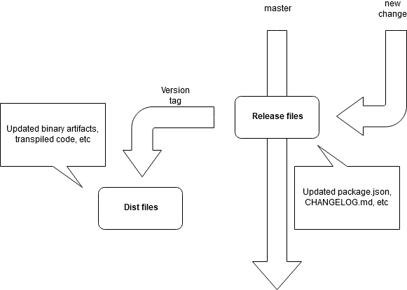

# standard-version-tagger

Helps make [standard-version](https://github.com/conventional-changelog/standard-version) releases using tagged dist data. 📦🎁📃



This pattern is useful when you want to have GitHub Releases that contain generated artifacts as part of the source tree, but you do not want these artifacts in master. A common usage of this pattern is [the jquery repo](https://github.com/jquery/jquery) - note how the `dist/` folder on [`master`](https://github.com/jquery/jquery/tree/master/dist) is empty, but [`v3.4.1`](https://github.com/jquery/jquery/tree/3.4.1/dist) contains artifacts.

Further, master still contains a release commit in it's tree, with the updated `package.json` and `CHANGELOG.md`, in the tree at the commit from which the dist tag forks. This lets master show releases rolling forward, without containing dist files.

**Disclaimer**: This pattern is not a good idea if your dist files are large binaries - note that while these files won't appear on the `master` branch, they're still tracked by git, and will increase the repo size, and slow some git operations. Here's [a good stackoverflow article](https://stackoverflow.com/questions/29393447/why-cant-git-handle-large-files-and-large-repos) on the topic.

## Usage

First, install this package, and [standard-version](https://github.com/conventional-changelog/standard-version) as `devDependencies`:

```
npm i -D standard-version @overlayed-app/standard-version-tagger
```

Then, configure standard-version properly, in your `package.json`:

```
"standard-version": {
  "scripts": {
    "postcommit": "npx @overlayed-app/standard-version-tagger"
  },
  "skip": {
    "tag": true
  }
}
```

Then, run `standard-version`:

```
npx standard-version
```

This replaces the built-in `standard-version` tag functionality with our tagger. To further configure our tagger, use the following environment variables:

- `DIST_FILES` - the [git pathspec](https://git-scm.com/book/en/v2/Git-Internals-Environment-Variables#_pathspecs) used to add dist files. Default: `dist/*`.
- `REL_BRANCH` - the release branch of your repo. Default: `master`.
- `TAG_BRANCH` - the tag branch of your repo. Default `tagger/well-known/<version>`.

The `TAG_BRANCH` allows you to specify a branch that will be created as a fork of your `REL_BRANCH` **in the local repo only** to house the commit for the tag. This provides a convienient way to reference that specific commit, if you're unable to use the tag itself. In practice, this is rarely needed.

Once you're using the tagger, you probably want to push the commits and tags to github after each [Continuous Deployment](https://www.atlassian.com/continuous-delivery/continuous-deployment) run. To do so:

```
git push origin master
git push --tags
```

Assuming that:

- Your `REL_BRANCH` is `master`
- Your CD process does not introduce any other tags your wouldn't want pushed

## License

MIT
